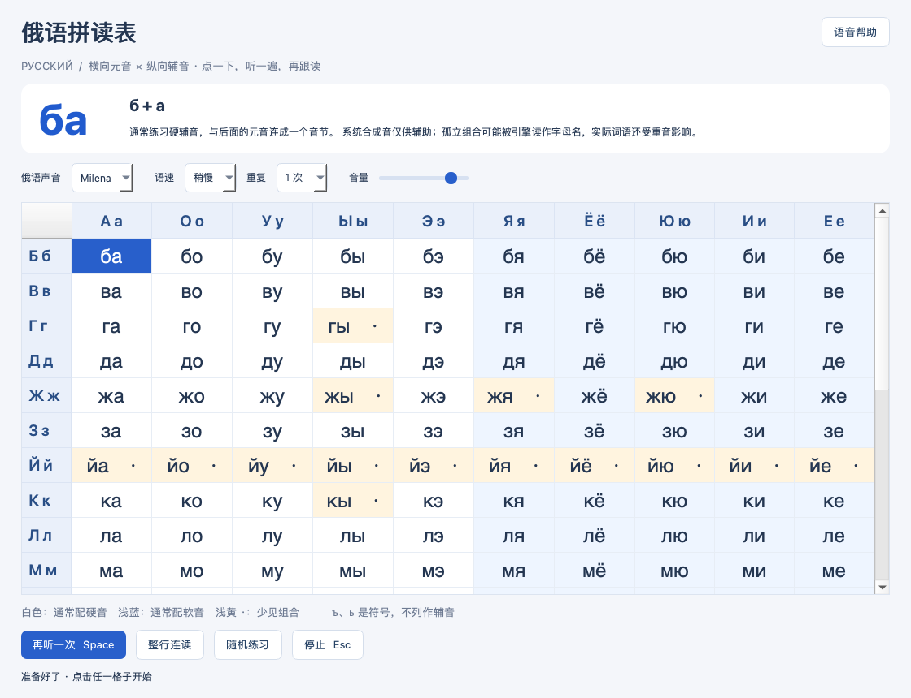

# Jobs 俄语拼读表



[toc]

---

## 🔥 <font id=前言>前言</font>

使用 [**Python**](https://www.python.org/) 和 [**PySide6**](https://doc.qt.io/qtforpython-6/) 编写的离线桌面练习工具。横向 10 个俄语元音、纵向 21 个辅音，共 210 个可点击组合；ъ、ь 不属于辅音字母，不列入表格。

## 一、使用方法

- 点击格子：朗读辅音与元音的组合；快速点击新格会取消上一项。
- 点击顶部元音或左侧辅音：单独朗读对应字母，共 31 个字母入口；同样支持语速、重复与音量设置。系统可能使用字母名称朗读，辅音字母名称不等同于纯辅音音素。
- 空格 / 回车：重听当前字母或组合。方向键：移动选择。Esc：停止。
- 语速支持慢速、稍慢、正常；重复支持 1–3 次；支持音量、整行连读和随机练习。
- 顶部显示当前组合与软硬音提示；语音、音量和语速在关闭窗口时保存到系统用户设置。
- 白色为通常配硬音，浅蓝为通常配软音，浅黄加点为少见／非典型拼写。ж、ш、ц 通常恒硬，й、ч、щ 通常恒软。随机练习避开少见组合。
- 每一格都可试听，但不是每种排列都是常用拼写。系统 TTS 可能将孤立组合读成字母名；本工具不提供经教师逐项审校的音素录音，不替代教材。实际词语另有重音、弱化、外来词等规则。

## 二、运行与俄语声音

当前交付已附带 Apple Silicon Mac 的 `.app` 和 `.dmg`；双击外层目录的 `俄语拼读表.app` 即可打开。Windows 使用源码工程在本机打包。

成品应用无需安装 Python 或 Qt，但依赖操作系统的俄语语音包。没有俄语声音时明确提示，不会用英语声音代替。

macOS：系统设置 → 辅助功能 → 朗读相关设置 → 系统声音，添加俄语 Milena；不同系统版本名称可能不同。

Windows：设置 → 时间和语言 → 语言和区域，添加俄语并安装语音组件。完成后重新打开应用。优先采用系统 WinRT 引擎，必要时尝试 SAPI。

源码运行（在本 README 所在目录打开终端）：

```sh
python3 ./JobsRussianTrainer/scripts/manage.py run
```

Windows 将 `python3` 改为 `py -3`。构建／开发环境需要 Python 3.11–3.14。管理入口先展示说明并确认，仅在依赖缺失时安装到工程 `.venv`，不会修改全局 Python。

## 三、打包

| 入口 | 平台与用途 | 产物 |
| --- | --- | --- |
| `./【MacOS】📦生成dmg.command` | macOS 本机构建，双击后回车确认 | `./dist/Darwin-架构-时间/JobsRussianTrainer.app` 和 `.dmg` |
| `./【Windows】📦生成exe.bat` | Windows 本机构建，确认后检查 Python | `./dist/Windows-架构-时间/JobsRussianTrainer.exe` |

使用 [**PyInstaller**](https://pyinstaller.org/) 包含 Python 运行时和 Qt 依赖。macOS 和 Windows 必须分别在对应系统上构建；Apple Silicon 与 Intel 默认跟随构建机架构。构建输出用时间戳隔离，不删除或覆盖旧产物。外层脚本只检查环境和调用内层构建器。

首次构建需要网络安装缺失依赖；正常使用发音不需要网络。日志追加保存在系统临时目录的 `JobsRussianTrainer-build.log`。Mac 入口只修改本项目环境与产物；不使用 sudo，不修改系统语音设置。应用未进行开发者证书签名或公证，公开分发前需自行配置。

## 四、工程结构

```text
JobsRussianTrainer.py/
├── README.md
├── 【MacOS】📦生成dmg.command
├── 【Windows】📦生成exe.bat
└── JobsRussianTrainer/
    ├── pyproject.toml
    ├── src/russian_trainer/
    │   ├── app.py             # 窗口和交互
    │   ├── data.py            # 字母表与学习提示
    │   └── speech.py          # 系统语音与串行播放
    ├── scripts/
    │   ├── entry.py           # 打包入口
    │   └── manage.py          # 虚拟环境、运行及构建
    └── tests/
```

## 五、验证与参考

```sh
cd ./JobsRussianTrainer
PYTHONPATH=src python3 -m unittest discover -s tests -v
python3 -m compileall -q src scripts tests
```

Windows 测试先执行 `set PYTHONPATH=src`，再使用 `py -3 -m unittest discover -s tests -v`。Windows 产物需在 Windows 上实际构建并验证声音，不能以 macOS 检查代替。

验证基线：Python 3.14.7、PySide6 6.11.2、PyInstaller 6.22.3、macOS arm64。9 项自动测试通过，覆盖 210 格映射、31 个单字母入口、表头鼠标点击、重听目标切换、快速点击、停止、重复、错误和无声音场景；已检查窗口截图并实测 Milena 顺序朗读及快速切换。Mac `.app` / `.dmg` 已实际构建；独立成品通过真实窗口及 `а → б → ба` 单字母与组合播放冒烟检查。构建器显式收集 Qt 窗口和语音插件，兼容 Homebrew 的非 wheel 目录布局。Mac 脚本通过 `zsh -n`，Windows 脚本仅完成静态检查。

参考：[康奈尔大学俄语字母与发音](https://russian.cornell.edu/russian.web/courses/305/letters_sounds_1.htm)、[俄语学习平台语音说明](https://russky.info/grammar/phonetics?hl=en)、[Qt 系统语音引擎](https://doc.qt.io/qt-6.5/qttexttospeech-engines.html)。

## 六、常见问题

**点击没有声音？** 先检查系统输出设备、系统与应用音量；查看窗口底部错误，再检查俄语语音包。安装后重新打开应用。

**某一格听起来不自然？** 浅黄格只是非典型组合试听；系统语音对孤立字母组合的处理并不等于经过审校的音节录音。结合教材或教师读音校正。

**能直接在 Mac 上生成 Windows EXE 吗？** 不能。把整个源码工程复制到 Windows，排除 `.venv`、`build`、`dist` 后运行 Windows 打包入口。

<a id="🔚" href="#前言" style="font-size:17px; color:green; font-weight:bold;">我是有底线的➤点我回到首页</a>
